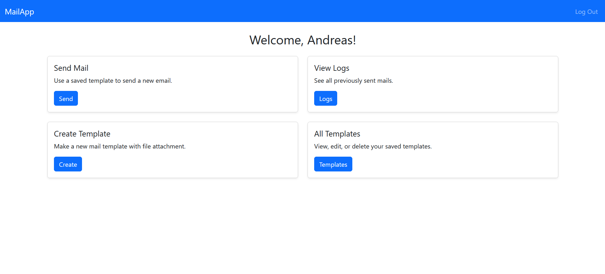
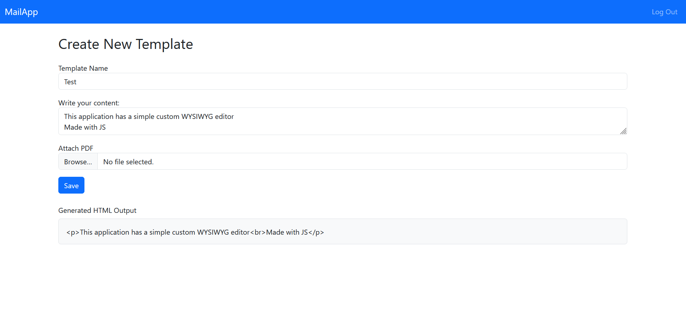
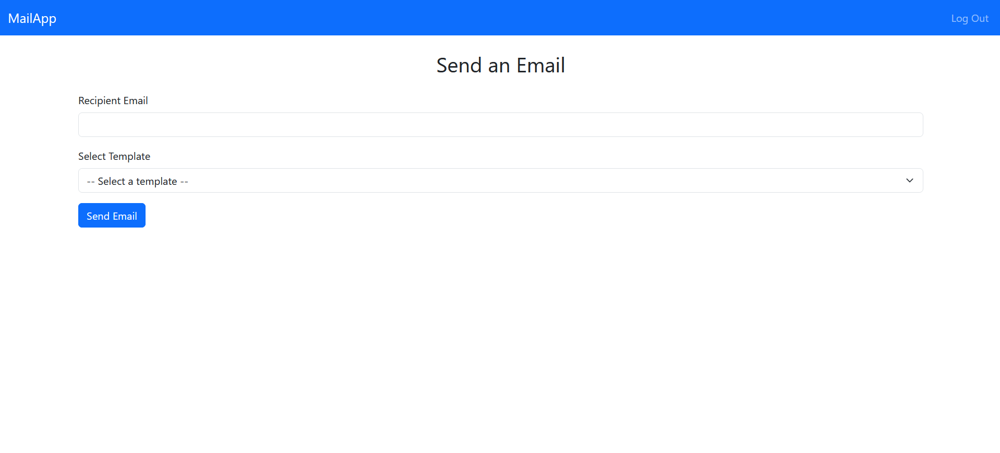

# 📬 Flask Mail Automation App

A full-stack web application for sending templated emails with optional PDF attachments. Built with **Flask**, **Bootstrap**, and **SQLAlchemy**, and designed with Clean Code principles, modular architecture, and secure form handling using **Flask-WTF**.

---

## 🚀 Features

- 🔐 **User Authentication** (Login & Register)
- 📝 **Create, Edit, Delete Email Templates** with rich text formatting and PDF upload
- 📤 **Send Emails** using predefined templates
- 🕓 **Email Logs**: View when and to whom templates were sent
- 🧹 **Clean UI** styled with **Bootstrap 5**
- ⚙️ **Modular Architecture** with Blueprints & Services
- 💾 **Database Integration** using **SQLAlchemy**
- 🛡️ **CSRF Protection** and **Input Validation** with Flask-WTF
- 🧼 HTML sanitization using BeautifulSoup to prevent XSS
- 🧪 Easily testable structure with separated concerns

---

## 🖼️ Screenshots

<details>
<summary>Click to expand</summary>

- **Dashboard**

  

- **Create Template**

  

- **Send Email**

  

</details>

---

## 📦 Tech Stack

| Category         | Tech                     |
|------------------|--------------------------|
| Backend          | Flask, Jinja2, SQLAlchemy |
| Frontend         | Bootstrap 5, JavaScript  |
| Forms & Security | Flask-WTF, WTForms       |
| DB               | SQLite (Dev), SQLAlchemy |
| Dev Tools        | WSL, Git, Python 3.11    |

---

## 🛠️ Installation

```bash
# Clone the repository
git clone https://github.com/AndreasVG1/mail-sender.git
cd flask-mail-app

# Create a virtual environment
python3 -m venv venv
source venv/bin/activate  # on Windows use `venv\Scripts\activate`

# Install dependencies
pip install -r requirements.txt

# Run the app
flask run
